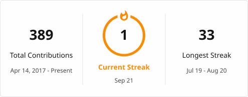

---

### 👀 Profile Views

  

---

### 🚀 About Me
- Backend-focused engineer with 6+ years of experience  
- Expertise in Java, Spring Boot & Microservices  
- Focused on scalable system design & clean architecture  
- Exploring distributed systems & cloud technologies  

---

### 🛠️ Tech Stack
- **Java | Spring Boot | Microservices**
- **REST APIs | SQL | Kafka**
- **Docker | AWS | Git**

### 🔥 Streak Stats

  

---

### 🐍 Contribution Snake

  

---

### 🎯 Current Focus
- System Design
- Backend Performance Optimization
- Open Source Contributions

---

### 🤝 Connect
- Open to backend opportunities & collaborations
